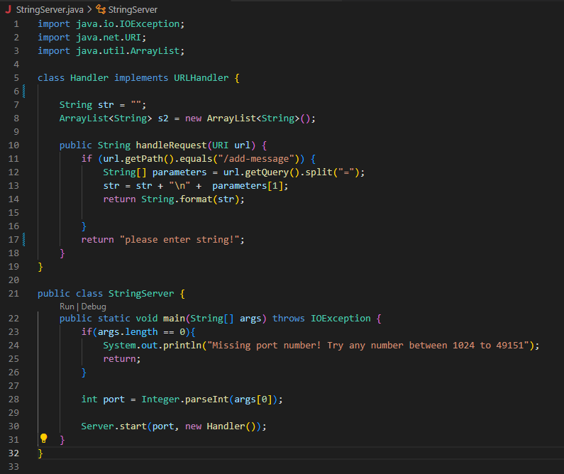
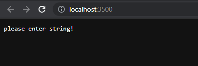
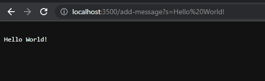
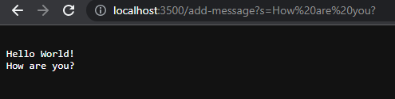
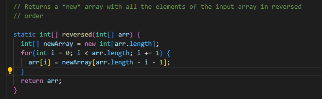
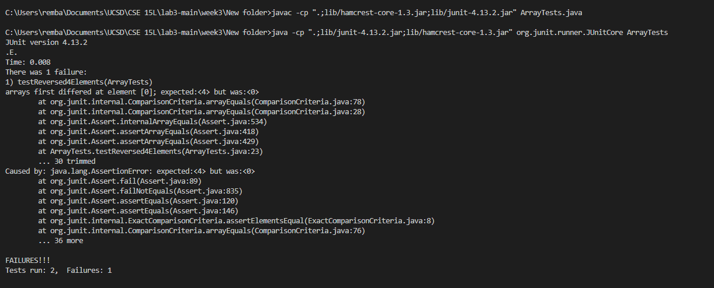

# Lab Report 2

## Part 1

This is a file that sets up a server named StringServer:



The class StringServer sets up the server, and the class Handler decides what the server does with a URL handle.


When you visit the website created by the server, you can enter prompts into the URL which are then used as arguments in the various methods of StringServer.java

This is what my StringServer should look like when it first starts up:



You can enter a string into the URL in the form /add-message?s=<insert string here>, and the string should appear on the screen

For example, adding

/add-message?s=Hello World 


results in the following:




When using /add-message, the handleRequest method is called, using the entire URL as its argument.


The handleRequest method detects if the phrase "/add-message" is in the URL, then splits the URL to find the query and the string to add. 

With every server, the String str is instantiated with an empty string.


The handleRequest method then concatenates str with everything after the "=" in the URL.

If you enter another /add-message command into the URL, it should display your most recent string below the previous string.



When we enter "How are you?" into the URL, it calls the handleRequest method again, using the entire URL as the argument once more.

As before, the handleRequest method splits the URL into its path, query, and string to add. 

Then, the string to add is concatenated with a new line operator "\n" along with str. 

This stores both the current and all previous entries in the URL. 


## Part 2

This part of the lab report will analyze the buggy reversed(int[] arr) method:




Failure inducing input:
```
@Test
  public void testReversed4Elements() {
    int[] input1 = {1,2,3,4};
    int[] output1 = {4,3,2,1};
    assertArrayEquals(output1, ArrayExamples.reversed(input1));
  }

```

The method does not correctly reverse an array sorted least to greatest.


Non-Failure inducing input:

```

  @Test
  public void testReversed() {
    int[] input1 = { };
    assertArrayEquals(new int[]{ }, ArrayExamples.reversed(input1));
  }

  ```

The method can correctly deal with an empty array.


Output of running the two tests:



The reversed(int[] arr) method before any changes:

```
  static int[] reversed(int[] arr) {
    int[] newArray = new int[arr.length];
    for(int i = 0; i < arr.length; i += 1) {
      arr[i] = newArray[arr.length - i - 1];
    }
    return arr;
  }

```

The reversed() method with fixes:
```
static int[] reversed(int[] arr) {
    int[] newArray = new int[arr.length];
    for(int i = 0; i < arr.length; i += 1) {
      newArray[i] = arr[arr.length - i - 1];
    }
    return newArray;
  }
```

Previously, the reversed(int[] arr) had created a new Array called newArray, but it was setting values of the input array arr equal to values of the empty newArray with
```
arr[i] = newArray[arr.length - i - 1];
```
It would then return arr.

Therefore, the array that is returned is simply an array of zeros.

The fixed method changes the line of code specificed above to

```
newArray[i] = arr[arr.length - i - 1];
```

and now returns newArray. Now, the method correctly assigns the values of arr in a reversed order in a new array. 

## Part 3
During lab week 2, I learned the basics of how servers and URLs worked when I previously did not know much about the topic. For instance, I did not specifically how changes in the URL would send information to a server and make changes with it. With the week 2 lab activity, I was able to set up my own server running both on my local computer and remotely, and I experimented with changing the URL to create a String output.