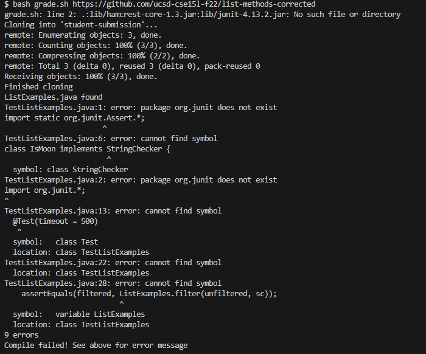
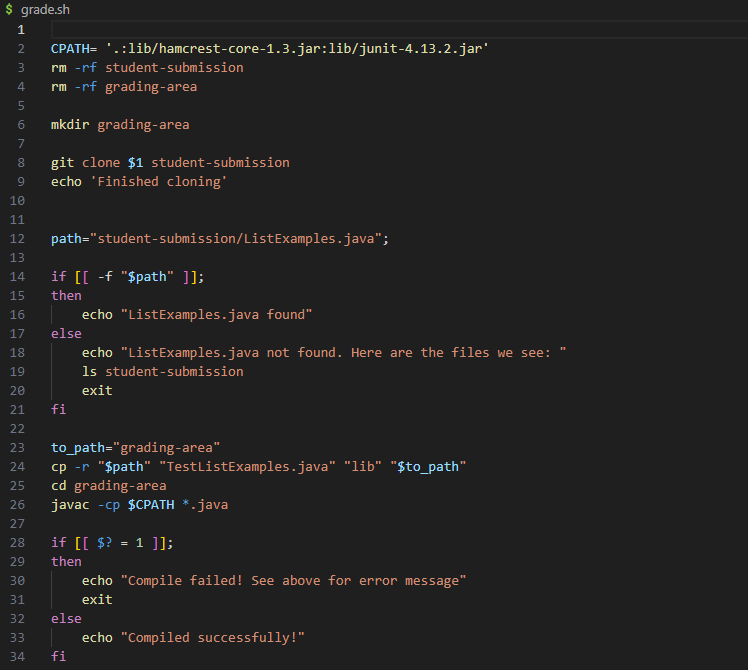

# Lab Report 5

## Part 1

1. 
Hello, I am having some trouble runningn my grading script that I worked on for lab 6. Currently, I am using a Windows operating system and using VScode for my terminal and editor. For the symptom, whenever I run 

``` bash grade.sh https://github.com/ucsd-cse15l-f22/list-methods-corrected``` 

the following error message is shown on my terminal:




My bash script is shown here:



Since I am grading the corrected version of the list methods, I expect the grader and all tester methods to compile and run correctly with no failed tests.

The error message shows that the bash script runs correctly until the line 

```javac -cp $CPATH *.java```

where it then fails to compile TestListExamples.java

My working directory shows that I am in the correct directory to run   ```javac``` commands, and I have not changed any of the original code already provided by the files from Github. I am not sure what else could be causing the error. Is it a problem with the ListExamplesTests.java file? Or might there be a problem with the use of ```*.java```? Any help is appreciated!


2. 
Hello, you have already narrowed down the search for the bug quite a bit. The problem does seem to originate from ```javac -cp $CPATH *.java```, and the use of ```*.java``` is appropriate and should not be causing the error. To compile JUnit testers, you may use the commands we have provided you in previous lab descriptions and make sure they match exactly with what you have for CPATH. 

3. 
I looked at the javac command for JUNIT testing in lab 3, and I replaced what was in CPATH with 
```".;lib/hamcrest-core-1.3.jar;lib/junit-4.13.2.jar"```
and it successfully compiled! Turns out, the file from Github uses the javac commands for Mac users as default, and I had to change the command to the javac commands for Windows. Now that I am correctly compiling JUNIT, my testers and grading script should all work as intended.


4. 
To set up the bug, we must use the Github repository https://github.com/ucsd-cse15l-s23/list-examples-grader.
Here, the working directory must be in list-examples-grader/. When the ls command is used, the grading-area/, lib/, and student-submission/ directories should be visible as well as the file grade.sh, Server.java, GradeServer.java, and TestListExamples.java

Before fixing the bugs, the contents of grade.sh should be as shown:
```
CPATH= '.:lib/hamcrest-core-1.3.jar:lib/junit-4.13.2.jar'
rm -rf student-submission
rm -rf grading-area

mkdir grading-area

git clone $1 student-submission
echo 'Finished cloning'


path="student-submission/ListExamples.java";

if [[ -f "$path" ]];
then
    echo "ListExamples.java found"
else
    echo "ListExamples.java not found. Here are the files we see: "
    ls student-submission
    exit
fi

to_path="grading-area"
cp -r "$path" "TestListExamples.java" "lib" "$to_path"
cd grading-area
javac -cp $CPATH *.java

if [[ $? = 1 ]]; 
then
    echo "Compile failed! See above for error message"
    exit
else
    echo "Compiled successfully!"
fi
```

All other files from the repository should remain as they were.

The full command to trigger the bug is

```bash grade.sh https://github.com/ucsd-cse15l-f22/list-methods-corrected``` 


To fix the bug, change the line that defines CPATH as 
```
CPATH= '.:lib/hamcrest-core-1.3.jar:lib/junit-4.13.2.jar'
```

to 

```
CPATH= ".;lib/hamcrest-core-1.3.jar;lib/junit-4.13.2.jar"
```

## Part 2
Something I learned about in this class that I did not know before was how to use vim to as a text editor. Until then, I had exclusively used VScode for all coding, and I did not know that text editors like vim existed. Just from the small parts of vim we explored in this class, I can see how vim could be extremely efficient once at a proficient level. In fact, shortly after being introduced to what vim was, I overheard someone in the library explaining how they used vim to write essays. From what I know, it looks like a very interesting and useful tool, and perhaps someday I can reach a level of comfort with vim to improve my editting efficiency as well.
