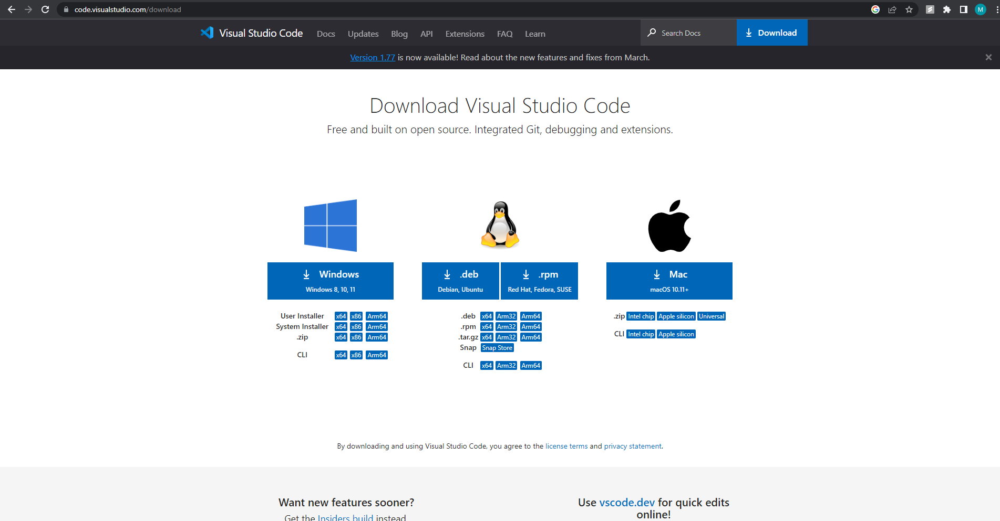
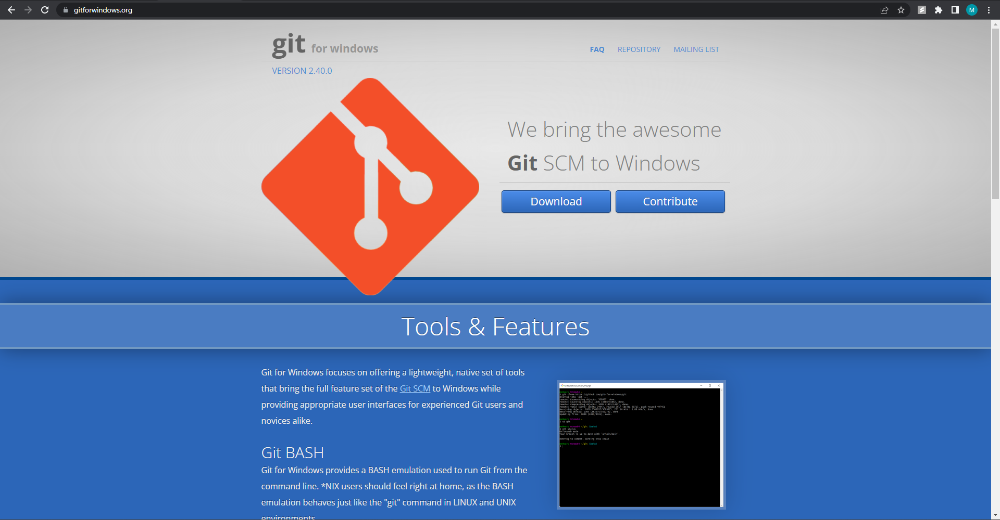
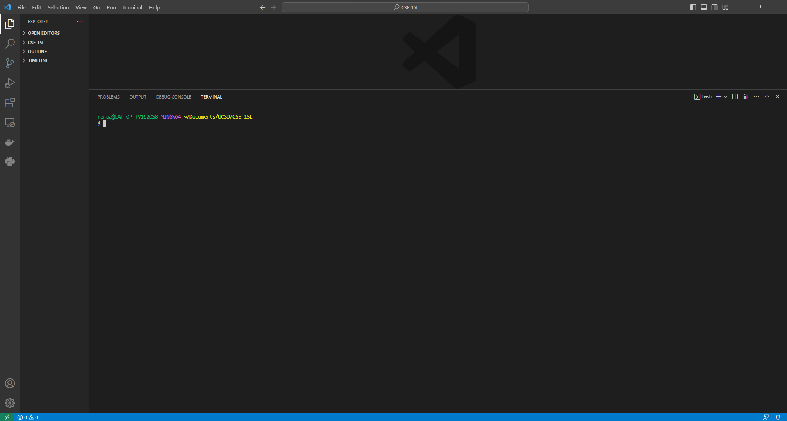
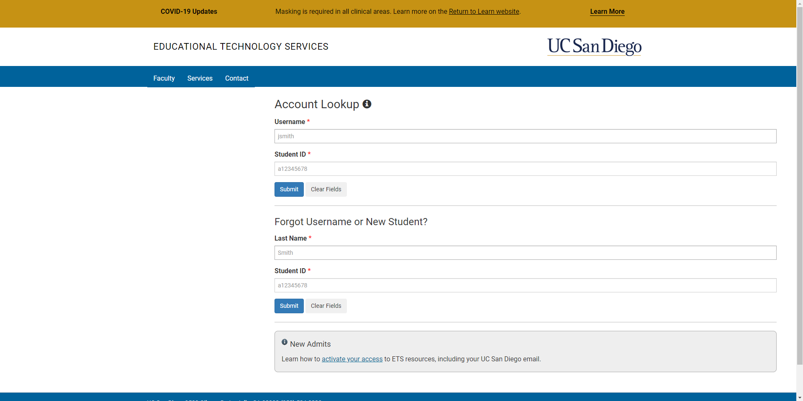
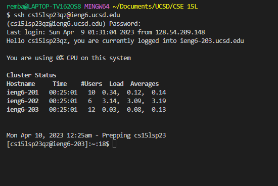
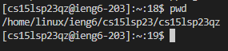
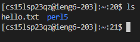

#  **Lab Report 1**
This lab report will describe how to remotely access a course-specific account on ieng6.

## 1. Downloading VisualStudiocode

VScode is an IDE that allows us to code in a more user friendly environment.
Visit the VScode website to download VScode. Make sure to download the version of VScode specified for your system.



---
Once VScode is downloaded, open it up and follow the prompts to set up your environment. If using Windows, make sure to download Git for Windows.



---
Once you are done setting up VScode, you can open a bash terminal to begin entering commands.
1. go to the "Terminal" tab in the top left
2. click on "New Terminal"
3. click on the drop down arrow on the right of the terminal
4. click on "Git Bash"
---
Now your VScode terminal should look something like this.



---

## 2. Accessing your ieng account
To find the information for your ieng account, find your course specific account on UCSD's ETS website. Enter your Last Name and Student ID to find your CSE 15L course user name.



Once you find your username, click on your CSE 15 username and use the Global Password Change Tool to reset your password.

Once you confirm your password change, your account should be all set!

---

## 3. Remotely Connecting
On your VScode terminal, enter the command 
```
$ ssh cs15lsp23zz@ieng6.ucsd.edu
```

replacing zz with the two letters in your own username. 

You should then be prompted to enter your password, which is the password to the account that you just set up.

Once you enter your password, you should see something like this on your terminal:



This means you have successfully remotely accessed your cse15l account!

---

## 3. Trying Commands
Now that you are logged in, time to start trying out commands.
First, you can try the command
```
$ pwd
```
which should print your working directory.



Next, you can try
``` 
$ ls
```
which should list the directories or files available in the working directory



Try the command
```
$ cd
```
and the name of a file or directory in order to access these files or directories, or you can use 

```
$ cd ../
```
to access the parent directory.

These are only some examples, feel free to try out more on your own!
