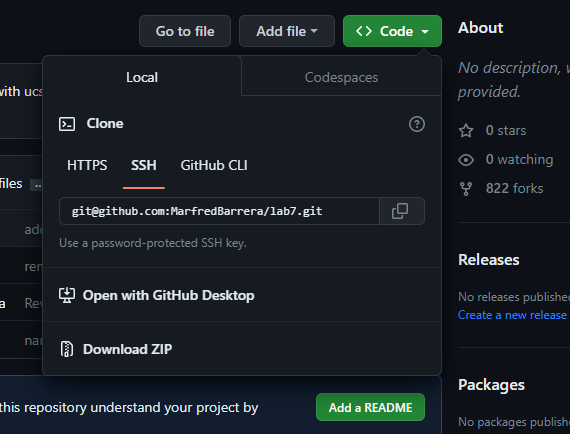
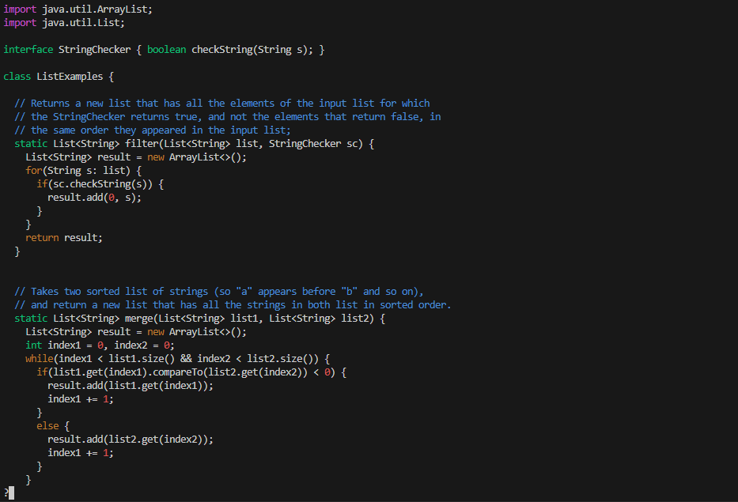
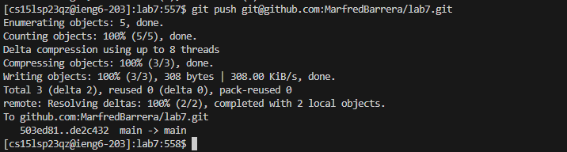

# Lab Report 4 

This lab report will detail the steps to cloning, editing, commiting, and pushing files using git and vim. We will be using the repository https://github.com/ucsd-cse15l-s23/lab7

**SETUP:** 
1: Delete any existing forks of the repository you have on your account.

 Visit your github and delete any existing forks of lab7 to start from scratch.

2: Fork the repository

 You now have a fork of the repository in your own account. 

3: Set up the timer!

**TASK:**

4: Log into ieng6

Type:

``` ssh cs15lsp23qz@ieng6.ucsd.edu```

```<Enter> ```

You should now be logged into ieng6, and you do not need to enter your password if you have set up your ssh key.


5: Clone your fork of the repository from your Github account

Type:

``` git clone git@github.com:MarfredBarrera/lab7.git ```


``` <Enter> ```

You can get the ssh key from your github account here:



After cloning the repository, you should see this:


6: Run the tests, demonstrating that they fail

Type:
```
cd lab7 
```
```
<Enter>
```

```
javac -cp .:lib/hamcrest-core-1.3.jar:lib/junit-4.13.2.jar *.java
```
```
<Enter>
```
```
java -cp .:lib/hamcrest-core-1.3.jar:lib/junit-4.13.2.jar org.junit.runner.JUnitCore ListExamplesTests.java
```
```
<Enter>
```

If you had previously run these commands, you can access these commands in your history using the key ```<up arrow>``` and ```<Enter>```. 

This should show that 1 test fails:


7: Edit the code file to fix the failing test

We will be using vim to edit the file.

Type:

``` vim Li <Tab> .java ```

Pressing tab will autofill ListExamples into the command line.


```<Enter>```

You should now be viewing the contents of ListExamples.java using vim.


Type:

``` <Shift + /> <1> <Enter> <n> <r> <2> <:><w><q> <Enter>```

Shift enter will activate search mode. 
You should see a question mark pop up in the bottom left corner when entering seach mode.


Pressing ```<1> ``` means that vim will search for instances of "1" in the file. 


We use ```<Shift+/```> as opposed to a normal search using ```/``` because it will scan the entire file and leave the cursor at the last instance of "1" it finds. 

In this case, the last instance of "1" in the file is on the same line as the instance of "1" that we want to change.

Pressing ```<Enter>``` completes the search command.


Pressing ```<n>``` will cyle through all the matches of the search command. In this case, we only have to press ```<n>``` once to get the character that we want to edit.


Pressing ```<r>``` activates the "replace" command, which will replace the highlighted character with the next character entered. You should see an "r" pop up in the bottom left corner, indicating you are using the "replace" command.


Pressing ```<2>``` uses the replace command to replace the "1" with a "2".


Press ```<Enter>``` to complete the command.

Pressing ```<:><w><q>``` saves your edits to the files and quits the file. You should see these characters in the bottom left corner.


Pressing ```<Enter>``` completes the ":wq" command and exits the file. 
We have now editted the file using vim.

8: Run the tests, demonstrating that they now succeed.

You can use the ```<up arrow keys>``` to type the javac and java commands since they were recently used.
I typed:

```<up> <up> <up> <Enter>``` to run ```javac -cp .:lib/hamcrest-core-1.3.jar:lib/junit-4.13.2.jar *.java```

```<up> <up> <up> <Enter> ``` to run ```java -cp .:lib/hamcrest-core-1.3.jar:lib/junit-4.13.2.jar org.junit.runner.JUnitCore ListExamplesTests```


9: Commit and push the resulting changes to your Github account.

Type:

``` git commit -m "fixed index bug" List<Tab>```
```<Enter>```

This commits the changes we made to ListExamples.java to the Github branch.
Pressing Tab autofills ListExamples.java. 


``` git push git@github.com:MarfredBarrera/lab7.git```

This pushes our changes to our Github account using our ssh key. 




